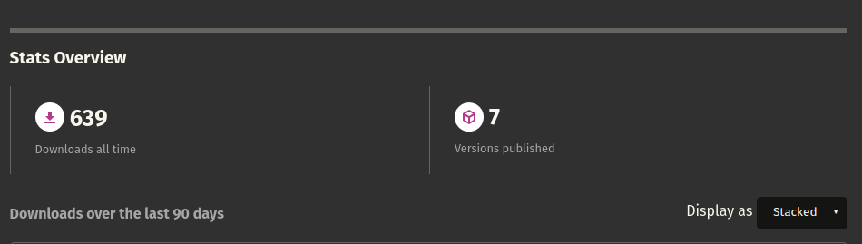

<h1 align="center">👋 Hello, I'm Thembinkosi Mkhonta</h1>
<h3 align="center">Software Engineer 👨‍💻 | Empowering Faster Development through Genesis Project</h3>

  
  
  
  
  
  

<h2>🚀 Featured Project: Genesis</h2>

  Genesis is a powerful, flexible, and user-friendly project starter tool for Go and Rust developers. Built with Rust, it streamlines the initial setup process, allowing developers to focus on building great applications and solving business problems.

  📦 <strong>Check out the <a href="https://crates.io/crates/genesis_rs">crate</a></strong>

   

<h2>💼 Expertise</h2>

<ul>
  <li>🖥️ Backend Development</li>
  <li>🔐 Finetuning LLMs</li>
  <li>⛓️ Kali Linux (hobby)</li>
</ul>

<h2>📫 Get in Touch</h2>

  
  
  

🌱 Always eager to learn, innovate, and contribute to cutting-edge technologies!

